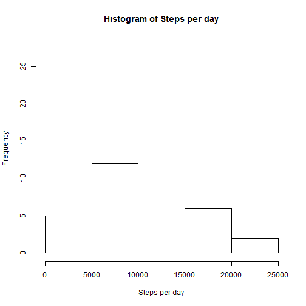
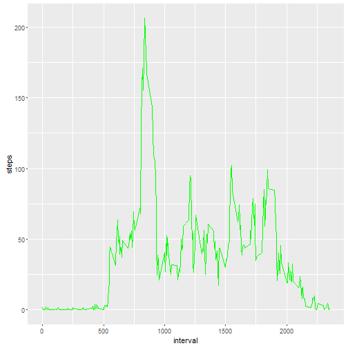
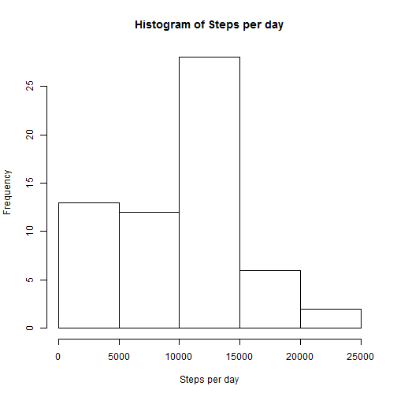

```r
require(ggplot2)
library(ggplot2)
library(knitr)
opts_chunk$set(echo=TRUE)
```

## Loading and preprocessing the data

```r
unzip("activity.zip")
activity <- read.csv("activity.csv",na.strings="NA",stringsAsFactors = FALSE)
str(activity)
```

```
## 'data.frame':	17568 obs. of  3 variables:
##  $ steps   : int  NA NA NA NA NA NA NA NA NA NA ...
##  $ date    : chr  "2012-10-01" "2012-10-01" "2012-10-01" "2012-10-01" ...
##  $ interval: int  0 5 10 15 20 25 30 35 40 45 ...
```


## What is mean total number of steps taken per day?

```r
steps_per_day <- aggregate(steps~date,data=activity,sum)

hist(steps_per_day$steps,xlab="Steps per day",main = "Histogram of Steps per day")
```



```r
na_mean_steps_per_day <- as.integer(mean(steps_per_day$steps))
na_median_steps_per_day <- as.integer(median(steps_per_day$steps))
```
Mean of the total number of steps taken per day: 10766  
Median of the total number of steps taken per day: 10765  


## What is the average daily activity pattern?

```r
avg_steps_per_day <- aggregate(steps~interval,data=activity,mean)

ggplot(avg_steps_per_day, aes(interval, steps)) + 
        geom_line(col="green")
```



```r
interval_max_steps <- avg_steps_per_day[avg_steps_per_day$steps==max(avg_steps_per_day$steps),]
```

Interval: 835, on average across all the days in the dataset, contains the maximum number of steps: 206.1698113


## Imputing missing values

```r
# Rows with steps value of NA 
na_rows <- nrow(activity[is.na(activity$steps),])

# steps NA values appear for the following dates:
unique(activity[is.na(activity),2])
```

```
## [1] "2012-10-01" "2012-10-08" "2012-11-01" "2012-11-04" "2012-11-09"
## [6] "2012-11-10" "2012-11-14" "2012-11-30"
```

```r
# Since there are NA values for steps in all intervals on these dates, estimating values for these dates with an aggregate would return NAs. Assumption: NA values imply no steps were taken, replacing NA values with 0.
activity_tidy <- activity
activity_tidy[is.na(activity_tidy)==TRUE] <- 0

steps_per_day <- aggregate(steps~date,data=activity_tidy,sum)

hist(steps_per_day$steps,xlab="Steps per day",main = "Histogram of Steps per day")
```



```r
mean_steps_per_day <- as.integer(mean(steps_per_day$steps))
median_steps_per_day <- as.integer(median(steps_per_day$steps))
```


Total number of missing values in the dataset (i.e. the total number of rows with NAs): 2304

Mean of the total number of steps taken per day: 9354  
Median of the total number of steps taken per day: 10395  

These values differ from the estimates from the first part of the assignment, Step per day bin, from 0 to 5000 increased.

Imputing missing data on the estimates of the total daily number of steps impacts:

Means went from 10766 to 9354

Medians went from 10765 to 10395

Histograms Step per day bin, from 0 to 5000, increased from 5 to 13.


## Are there differences in activity patterns between weekdays and weekends?

```r
activity_tidy <- transform(activity_tidy,day=factor(ifelse(weekdays(as.Date(activity_tidy$date), abbreviate = FALSE) %in% c("Saturday","Sunday"),"weekend","weekday")))

avg_steps_per_day <- aggregate(interval~steps +day,data=activity_tidy,mean)

ggplot(avg_steps_per_day, aes(interval, steps)) + 
        geom_line(col="green") +
        facet_wrap(~day,ncol = 1)
```


